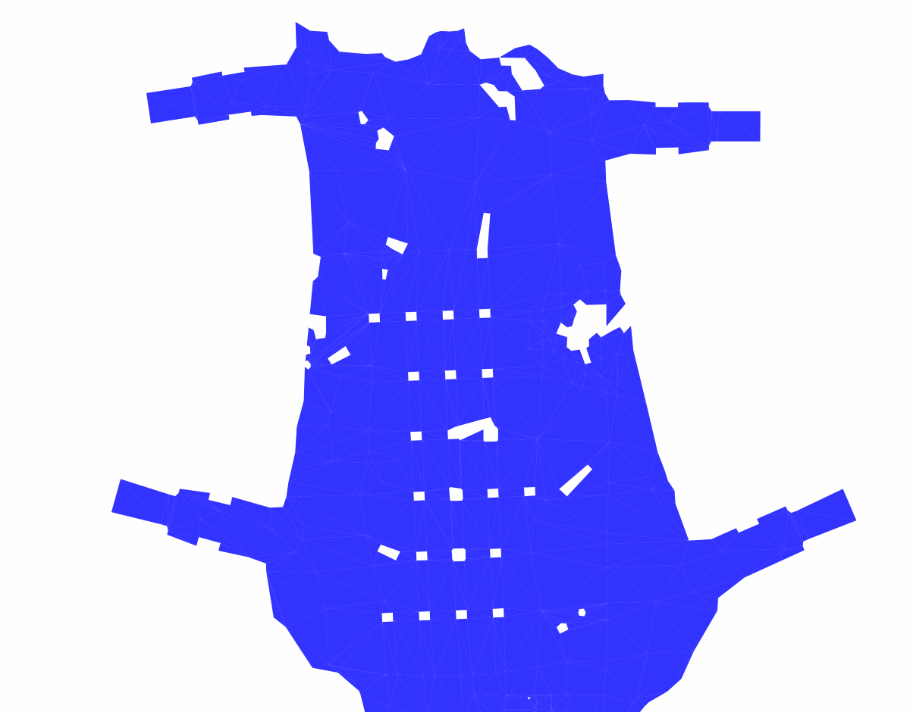
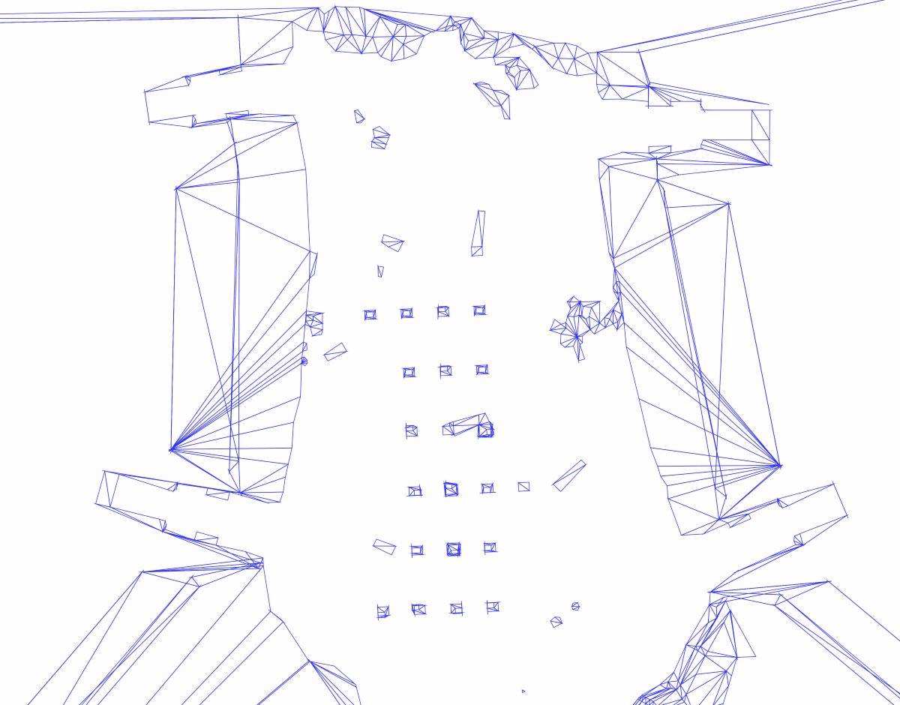
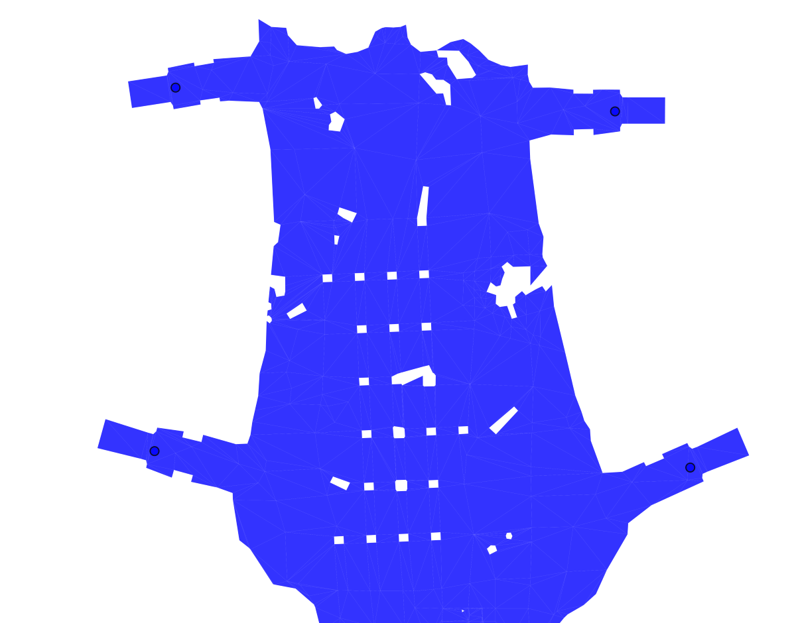
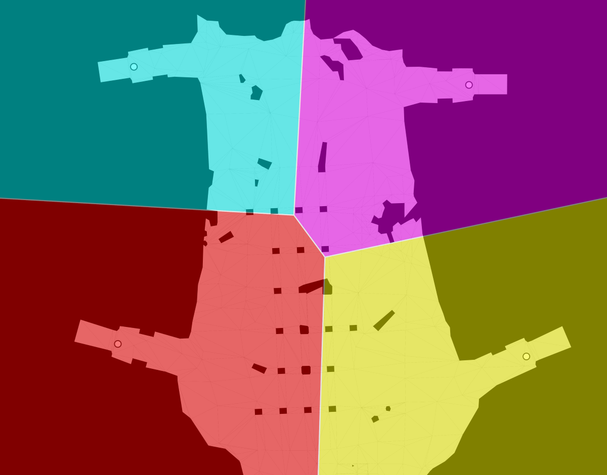
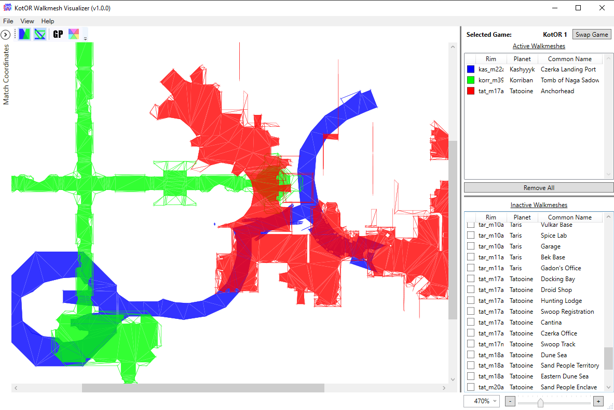
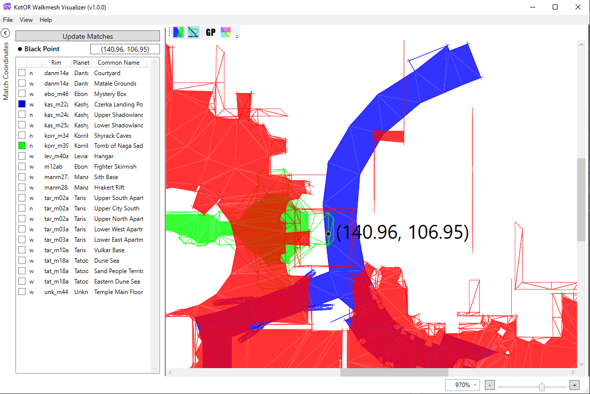

<h1>  KotOR Walkmesh Visualizer</h1>

A visualizer for Star Wars: Knights of the Old Republic (KotOR) 1 and 2 that overlays module walkmeshes. This is intented to be used as an exploratory tool for speedrunners or game modders. An installation of either KotOR 1 or 2 is required to make use of this tool.

## Features
* Display module walkmeshes of KotOR 1 and 2.
  * Can toggle display of walkable and non-walkable faces.
  * Can toggle display of transabort points and regions.
* Compare the coordinates of multiple modules.
* Get exact coordinates of a point within the module.
* Find other modules that overlap at one or two points.
* Walkmesh files are cached to speed up subsequent uses of the app.
* Save PNG image of the displayed modules.

## Credits
The walkmesh visualization projects were created by Glasnonck. This solution uses a couple of additional libraries that are free to use.
* [KotOR IO](https://github.com/LaneDibello/KotOR_IO) is used to read and write KotOR game files.
* [ZoomAndPan](https://www.codeproject.com/Articles/85603/A-WPF-custom-control-for-zooming-and-panning) is used for a simple method of displaying walkmeshes.

## Screenshots

<table>
  <tr><td colspan="2" align="center"><b id="general">Display Module Walkmeshes</b></td></tr>
  <tr>
    <td align="center">
      
      
    </td>
    <td>
      <ul>
        <li>Display a module's walkmesh in 2D space. Walkable and non-walkable surfaces can be shown or hidden separately.</li>
        <li>Walkable surfaces are those where the player can walk and are displayed as filled triangles.</li>
        <li>Non-walkable surfaces are those that block the player's movement and are displayed as outlined triangles.</li>
      </ul>
    </td>
  </tr>
  <tr><td colspan="2" align="center"><b id="modules">Gather Party Info</b></td></tr>
  <tr>
    <td align="center">
      
      
    </td>
    <td>
      <ul>
        <li>Display information related to the game's gather party feature. This info is primarily useful in combination with a glitch called a <a href="https://www.speedrun.com/kotor1/guide/77xef">GP warp</a>.</li>
        <li>Toggle visibility of the module's transit points. These points are where you are teleported if the game tells you to gather your party.</li>
        <li>While only viewing one module, toggle visibility of regions that indicate the nearest transit point. This is the point you'll be sent to if you perform a GP warp in that region.</li>
      </ul>
    </td>
  </tr>
  <tr><td colspan="2" align="center"><b id="items">Compare Modules</b></td></tr>
  <tr>
    <td align="center">
      
      
    </td>
    <td>
      <ul>
        <li>Compare the coordinates of multiple modules at the same time. Modules will be overlayed in 6 different colors.</li>
        <li>Double click to get the coordinate value anywhere on the map. At most, two points can be selected at a time.</li>
        <li>Check for other modules whose modules also contain the selected point(s).</li>
        <li>This is primarily useful for the <a href="https://www.speedrun.com/kotor1/guide/iarwc#ch4Coordinate_Warping">Coordinate Warp</a> glitch, which allows you to maintain a party member's location from one module to another.</li>
      </ul>
    </td>
  </tr>
</table>
