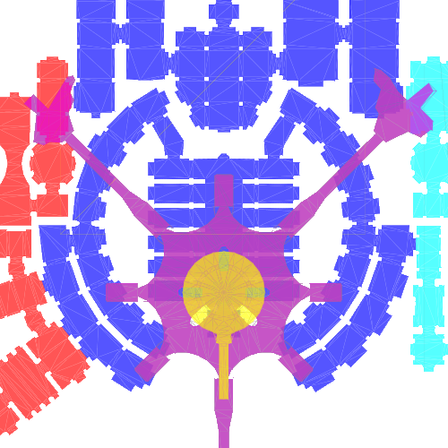

<h1>  KotOR Walkmesh Visualizer</h1>

A visualizer for Star Wars: Knights of the Old Republic 1 and 2 that overlays module walkmeshes. This is intented to be used as an exploratory tool for speedrunners.

## Features
* Display module walkmeshes of KotOR 1 and 2.
  * Can toggle display of walkable and non-walkable faces.
  * Can toggle display of transabort points and regions.
* Compare the coordinates of multiple modules.
* Get exact coordinates of a point within the module.
* Find other modules that overlap at one or two points.
* Walkmesh files are cached to speed up subsequent uses of the app.
* Save PNG image of the displayed modules.

## Credits
The walkmesh visualization projects were created by Glasnonck. This solution uses a couple of additional libraries that are free to use.
* [KotOR IO](https://github.com/LaneDibello/KotOR_IO) is used to read and write KotOR game files.
* [ZoomAndPan](https://www.codeproject.com/Articles/85603/A-WPF-custom-control-for-zooming-and-panning) is used for a simple method of displaying walkmeshes.
