<h1> 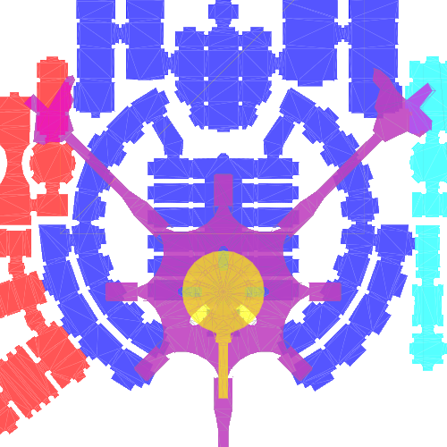 KotOR Walkmesh Visualizer</h1>

[](https://github.com/Glasnonck/WalkmeshVisualizer/releases/latest)
[](https://github.com/glasnonck/WalkmeshVisualizer/labels/bug)
[](https://github.com/glasnonck/WalkmeshVisualizer/labels/enhancement)
[](https://github.com/glasnonck/WalkmeshVisualizer/issues?q=is%3Aopen+-label%3Abug+-label%3Aenhancement)

A visualizer for Star Wars: Knights of the Old Republic (KotOR) 1 and 2 that overlays module walkmeshes. This is intented to be used as an exploratory tool for speedrunners. An installation of either KotOR 1 or 2 is required to make use of this tool.

## Credits
The walkmesh visualization projects were created by Glasnonck. This solution uses a couple of additional libraries that are free to use.
* [KotOR IO](https://github.com/LaneDibello/KotOR_IO) is used to read and write KotOR game files.
* [KotorMessageInjector](https://github.com/LaneDibello/KotorMessageInjector/) is used to read and write data from a live game process.
* [ZoomAndPan](https://www.codeproject.com/Articles/85603/A-WPF-custom-control-for-zooming-and-panning) is used for a simple method of displaying walkmeshes.

## Features and Screenshots

<table>
  <tr><td colspan="2" align="center"><b id="general">Display Module Walkmeshes</b></td></tr>
  <tr>
    <td align="center">
      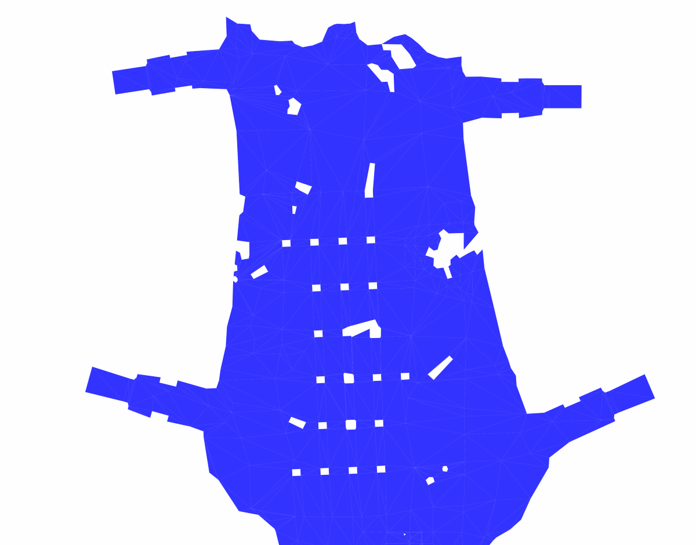
      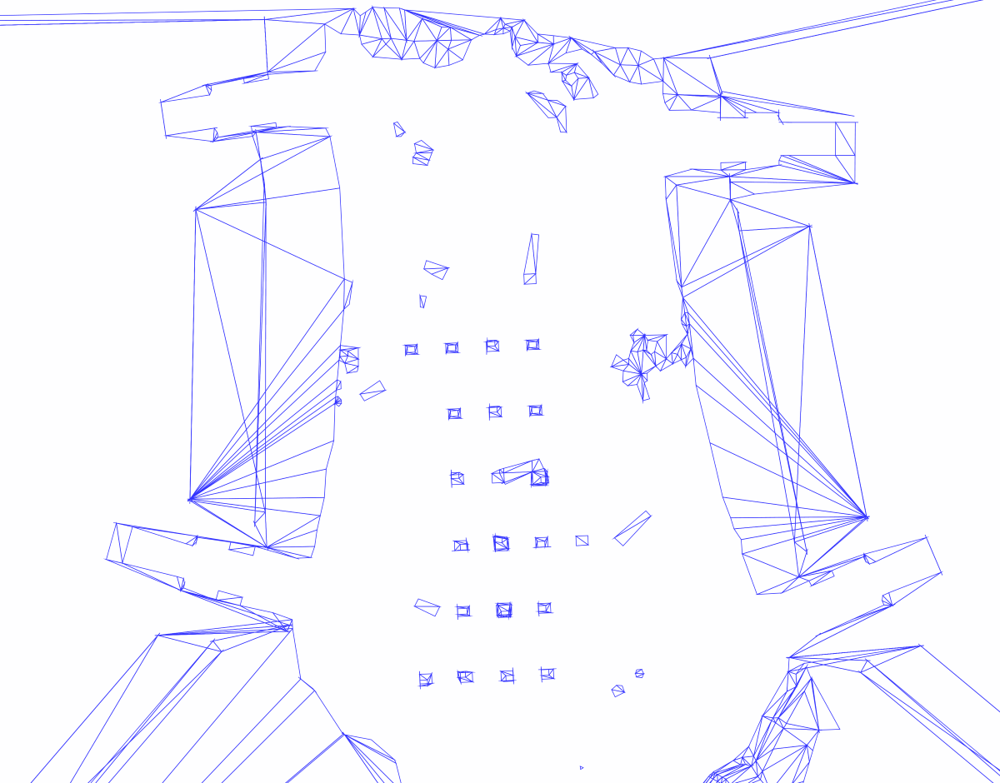
    </td>
    <td>
      <ul>
        <li>Display a module's walkmesh in 2D space. Walkable and non-walkable surfaces can be shown or hidden separately.</li>
        <li>Walkable surfaces are those where the player can walk and are displayed as filled triangles.</li>
        <li>Non-walkable surfaces are those that block the player's movement and are displayed as outlined triangles.</li>
      </ul>
    </td>
  </tr>

  <tr><td colspan="2" align="center"><b id="modules">Gather Party Info</b></td></tr>
  <tr>
    <td align="center">
      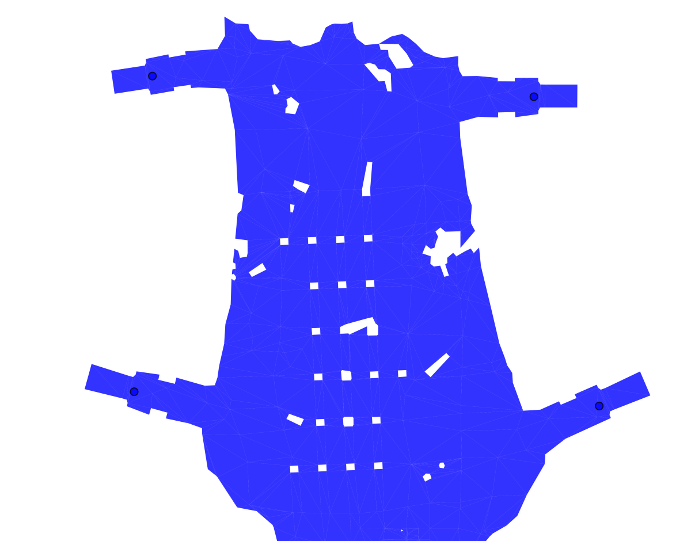
      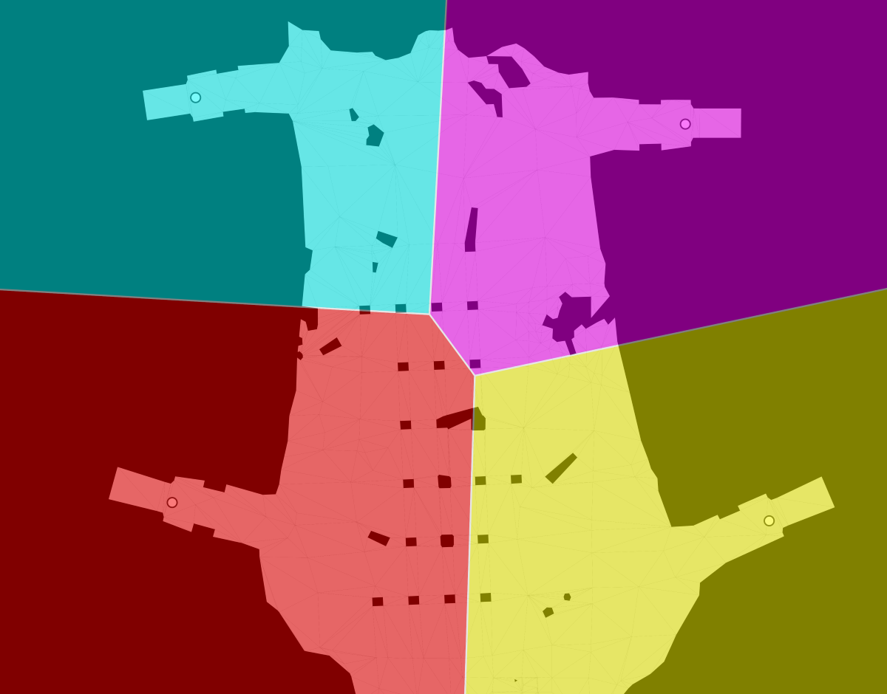
    </td>
    <td>
      <ul>
        <li>Display information related to the game's gather party feature. This info is primarily useful in combination with a glitch called a <a href="https://kotor-speedruns.github.io/kotor1/Techniques/GP%20Warp">GP warp</a>.</li>
        <li>Toggle visibility of the module's transit points. These points are where you are teleported if the game tells you to gather your party.</li>
        <li>While only viewing one module, toggle visibility of regions that indicate the nearest transit point. This is the point you'll be sent to if you perform a GP warp in that region.</li>
      </ul>
    </td>
  </tr>

  <tr><td colspan="2" align="center"><b id="items">Compare Modules</b></td></tr>
  <tr>
    <td align="center">
      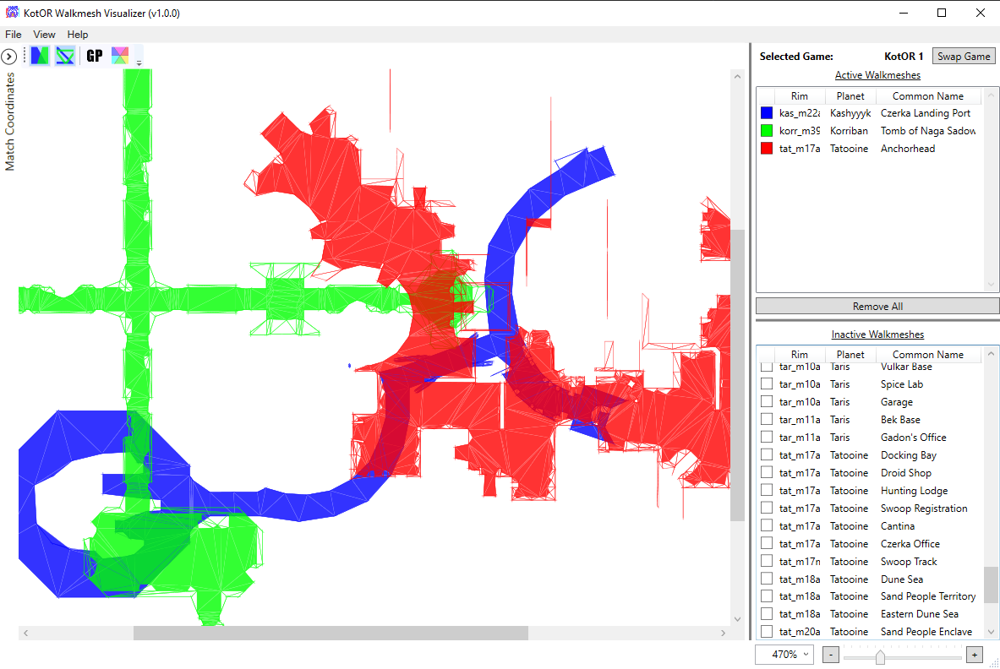
      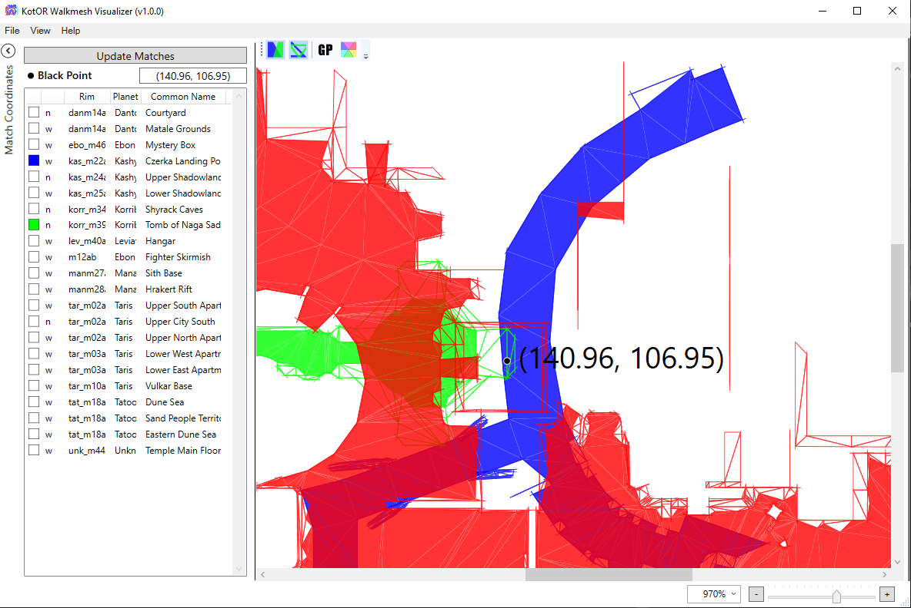
    </td>
    <td>
      <ul>
        <li>Compare the coordinates of multiple modules at the same time. Modules will be overlayed in 6 different colors.</li>
        <li>Double click to get the coordinate value anywhere on the map. At most, two points can be selected at a time.</li>
        <li>Check for other modules whose modules also contain the selected point(s).</li>
        <li>This is primarily useful for the <a href="https://kotor-speedruns.github.io/kotor1/Major%20Glitches/Coordinate%20Warps">Coordinate Warp</a> glitch, which allows you to maintain a party member's location from one module to another.</li>
      </ul>
    </td>
  </tr>

  <tr><td colspan="2" align="center"><b id="items">View Triggers and Doors</b></td></tr>
  <tr>
    <td align="center">
      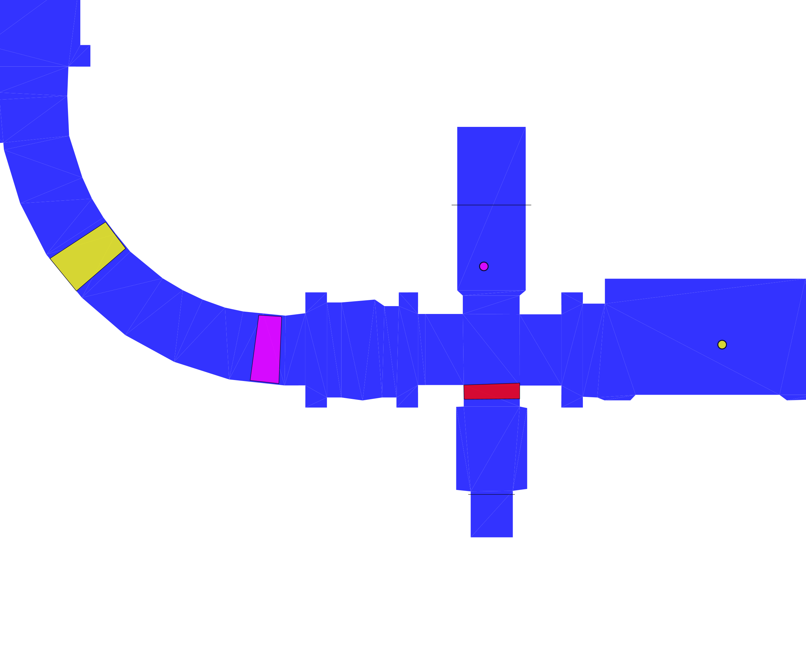
      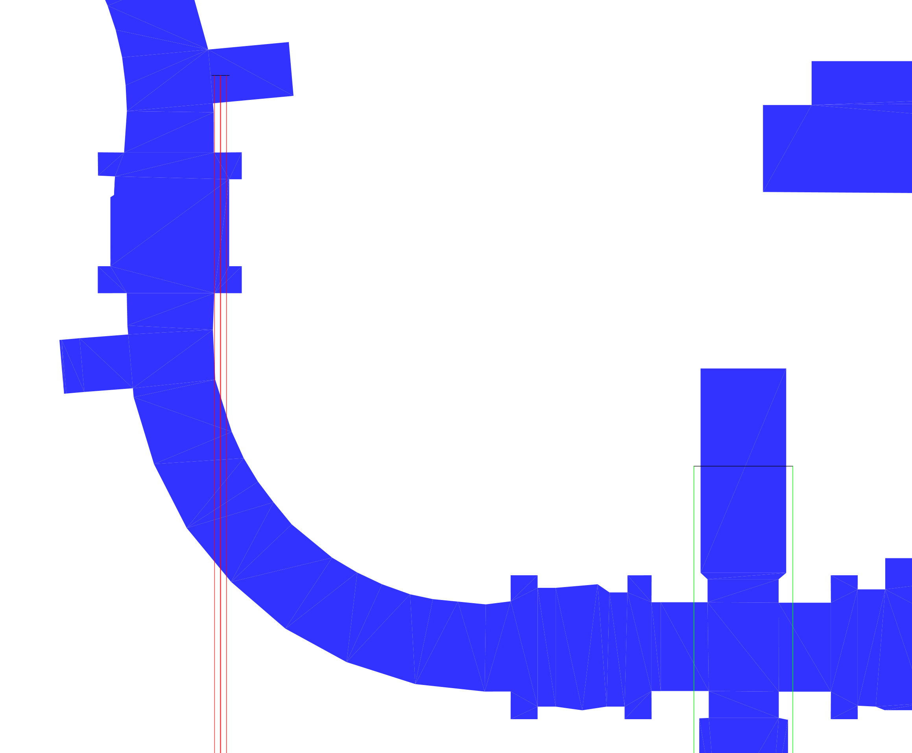
    </td>
    <td>
      <ul>
        <li>View doors, triggers, and encounters from each module.</li>
        <li>Only doors that are linked to another module can be displayed. The door model files have not yet been analyzed, so the shape of the door is not correctly displayed.</li>
        <li>Triggers and encounters display their entire geometry, allowing you to find gaps or route around them.</li>
        <li>Encounters also display the spawn point for enemies created by the encounter.</li>
        <li>A toggle button will display DLZ lines from each corner. This allows you to see where is possible to perform the <a href="https://kotor-speedruns.github.io/kotor1/Major%20Glitches/Displaced%20Load%20Zone">Displaced Loading Zone</a> glitch, which activates the trigger when your position matches exactly.</li>
      </ul>
    </td>
  </tr>

  <tr><td colspan="2" align="center"><b id="items">View Live Position</b></td></tr>
  <tr>
    <td align="center">
      
    </td>
    <td>
      <ul>
        <li>Watch party member position and direction update in real time as you play the game.</li>
        <li>Automatically load the walkmesh for the current level in-game, and automatically swap to a new walkmesh when entering a new level.</li>
        <li>Automatically detect which game is running and load the walkmesh data for that game.</li>
      </ul>
    </td>
  </tr>

  <tr><td colspan="2" align="center"><b id="items">View Gather Party Distance</b></td></tr>
  <tr>
    <td align="center">
      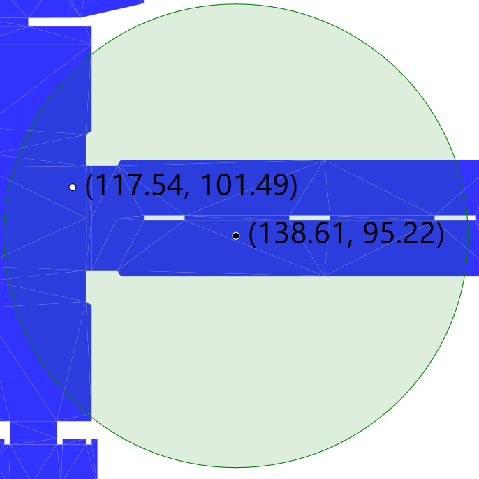
      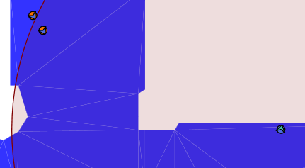
    </td>
    <td>
      <ul>
        <li>View the maximum distance party members can be from the Leader when traveling through loading zones. The highlighted area will display as Green when party members are in range and red when they are out of range.</li>
        <li>This range can be displayed either from the live Leader position or one of the double click coordinates.</li>
        <ul>
            <li>When displayed from the Leader, the circle will be green when all party members are in range and red otherwise.</li>
            <li>When displayed from the left-double-click point, the circle will be green when the right-double-click point is hidden or in range and red otherwise.</li>
        </ul>
        <li>The live Leader position GP range can be locked in place temporarily to assist when testing with no party members.</li>
      </ul>
    </td>
  </tr>

  <tr><td colspan="2" align="center"><b id="items">Distance and Real-Time Calculation</b></td></tr>
  <tr>
    <td align="center">
      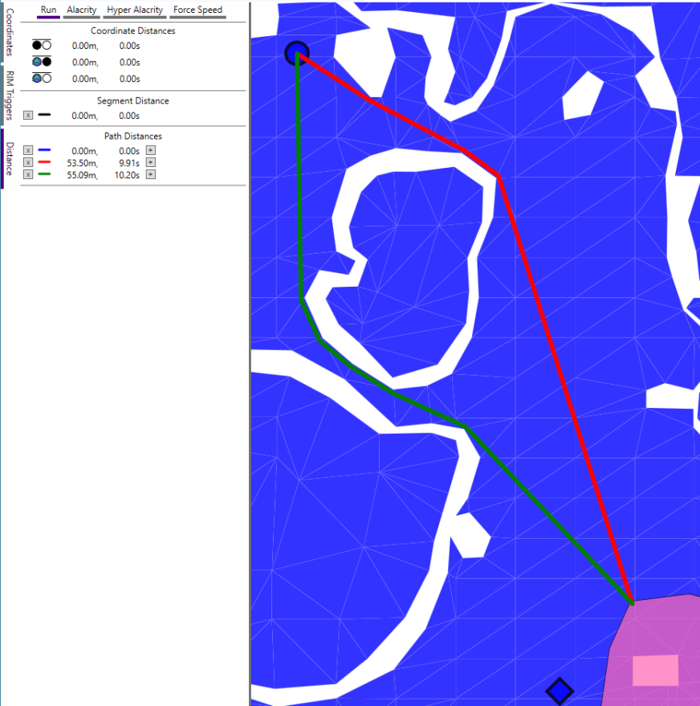
    </td>
    <td>
      <ul>
        <li>In-game distance can be calculated and displayed in both in-game units and the time it takes to travel that distance when running without buffs or with alacrity, hyper-alacrity, or force speed.</li>
        <li>Distance can calculated between double click points and the live Leader position.</li>
        <li>Distance can calculated as a single line segment or as a path of line segments. Up to three paths can be compared at the same time.</li>
      </ul>
    </td>
  </tr>

  <tr><td colspan="2" align="center"><b id="items">Wire Target Identification</b></td></tr>
  <tr>
    <td align="center">
      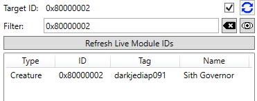
      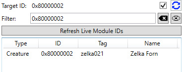
    </td>
    <td>
      <ul>
        <li>Find in-game objects that use the same object ID for <a href="https://kotor-speedruns.github.io/kotor1/Techniques/Wired%20Targeting">wire targeting</a>.</li>
        <li>Use "Target ID" to find and save the ID of the target object in the "Filter" box. Then search other modules for objects that share that ID using the "Refresh..." button.</li>
      </ul>
    </td>
  </tr>

  <tr><td colspan="2" align="center"><b id="items">Global Value Read, Write, and Watch</b></td></tr>
  <tr>
    <td align="center">
      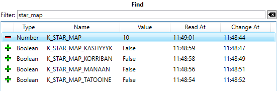
      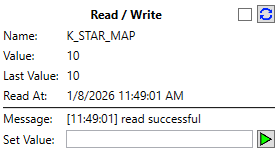
      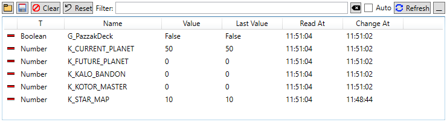
    </td>
    <td>
      <ul>
        <li>Read and write to in-game global variables.</li>
        <li>Watch global variables and see their values update in real-time.</li>
        <li>Save and load lists of global variables of interest to watch.</li>
      </ul>
    </td>
  </tr>
</table>

## Palettes
Walkmeshes can be displayed in a variety of color palettes. These palette files are stored locally in the directory "./Resources/Palettes/". The expected JSON file format is described below with an example. If you want to create a custom palette, duplicate and modify an existing palette file. The visualizer needs to be refreshed before any new palettes can be recognized.

- Name: This is the display name for the Palette or the Color, depending on where it is placed.
- Colors: This is a required property that defines the collection of Colors in the Palette.
- ColorText: This is the hex code of the desired color. The expected format is #AARRGGBB or #RRGGBB. The '#' character is required.

```
{
  "Name": "Bright",
  "Colors": [
    {
      "ColorText": "#FF0000FF",
      "Name": "Blue"
    },
    {
      "ColorText": "#FF00FF00",
      "Name": "Green"
    },
    {
      "ColorText": "#FFFF0000",
      "Name": "Red"
    },
    {
      "ColorText": "#FF00FFFF",
      "Name": "Cyan"
    },
    {
      "ColorText": "#FFFF00FF",
      "Name": "Magenta"
    },
    {
      "ColorText": "#FFFFFF00",
      "Name": "Yellow"
    }
  ]
}
```
